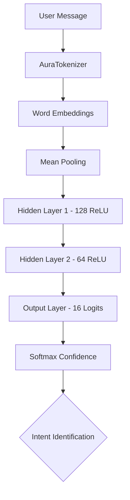
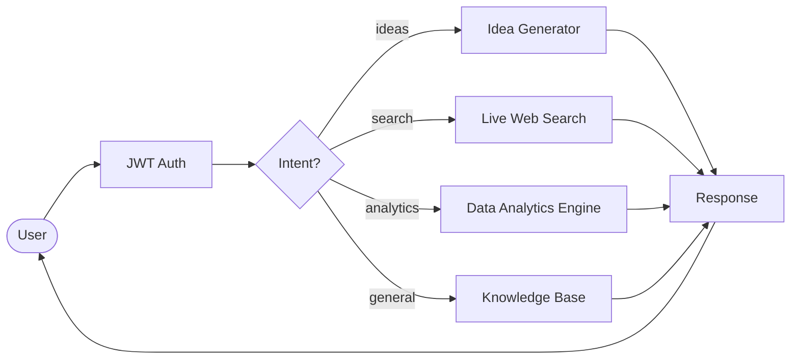

# AURA: AI Business Assistant

AURA (Advanced User Response Assistant) is a high-performance, locally-hosted AI Business Assistant designed for enterprise-grade analytics, market intelligence, and strategic ideation. Unlike traditional AI tools, AURA runs entirely on-device, ensuring maximum data privacy and low-latency responses without relying on external LLM APIs.

---

## 🏛️ Project Architecture

AURA is built on a modern decoupled architecture consisting of a high-performance Python backend and a responsive Flutter frontend.

### 🎨 Frontend (Flutter)
The frontend is a cross-platform application (targeting Linux, Android, and Web) built with **Flutter**. It provides a sleek, dark-themed dashboard inspired by modern financial terminals.

- **Screens**: Dashboard, Real-time Chat, Analytics (using high-fidelity charts), Market Intelligence, OKR Tracking, and Task Management.
- **State Management**: Built-in Provider/Bloc patterns for reactive UI updates.
- **Visuals**: Premium glassmorphic design and micro-animations for an immersive user experience.

### ⚙️ Backend (FastAPI + PyTorch)
The backend is a lightweight yet powerful Python service powered by **FastAPI**.

- **Orchestration**: Directs user queries to specialized AI modules (Idea Engine, Market Intel, Web Search).
- **Security**: JWT-based authentication and role-based access control (RBAC).
- **Core Engine**: Implements a custom neural network built from scratch using PyTorch for intent classification and text processing.

---

## 🧠 AI Deep Dive: How AURA Works

AURA's core intelligence resides in a custom-built AI pipeline that avoids the overhead of large language models while maintaining high accuracy for business-specific tasks.

### 1. Intent Classification (Neural Engine)
AURA uses a custom Deep Neural Network (`AuraNeuralNet`) to understand user requests.

- **Architecture**: 4-layer MLP (Multi-Layer Perceptron).
- **Embedding**: Learnable 64-dimensional word vectors.
- **Logic**: Maps text patterns to specific business domains such as `revenue`, `risk`, `ideas`, or `search`.

### 2. The Orchestration Logic
Once the intent is identified, the `AssistantAI` class routes the request to the appropriate tool.

### 3. Idea Generation Engine
The `IdeaGenerator` uses an "Augmented Ideation" approach:
- **Retrieval**: Pulls live market trends from DuckDuckGo/Bing.
- **Context**: Merges web data with local database alerts and KPIs.
- **Synthesis**: Uses high-entropy templates to generate novel business strategies and product ideas.

---

## 🖼️ Application Gallery

Behold the visual power of AURA. Every screen is designed for maximum clarity and strategic focus.

| Dashboard | Real-time AI Chat |
|:---:|:---:|
|  |  |

| Market Analytics | OKR Tracking |
|:---:|:---:|
|  |  |

| Idea Generation | Real-time Alerts |
|:---:|:---:|
|  |  |

| Tasks & Operations | Latest Market News |
|:---:|:---:|
|  |  |

---

## 🚀 Getting Started

1. **Backend**: `cd backend && pip install -r requirements.txt && python main.py`
2. **Frontend**: `cd frontend && flutter run -d linux`

---
_Documentation generated by AURA Development Team · 2026_